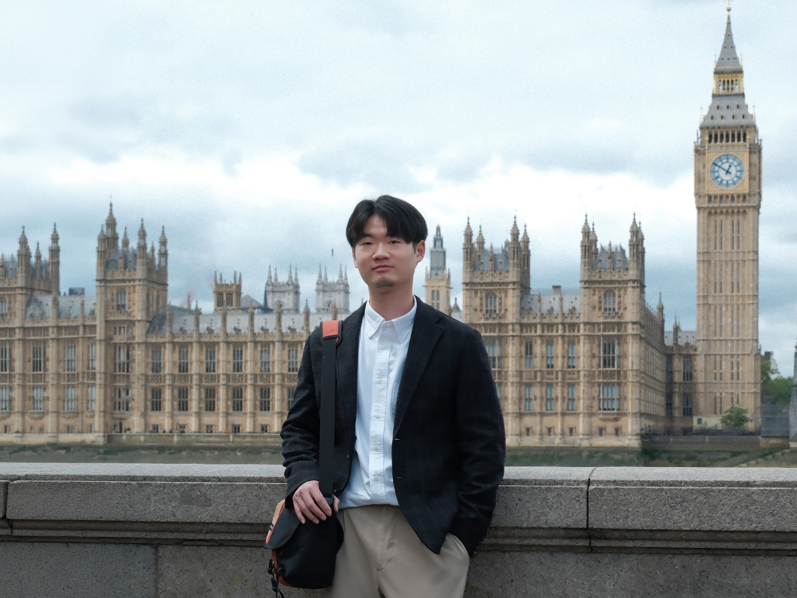

I am a Research Scientist at Meta's [AI System Co-Design](https://aisystemcodesign.github.io) team, working on performance projection for GenAI training and hardware/software co-design. I was also a Research Intern at Microsoft's AI Framework team, where I worked on automatic model parallelization for LLM serving.

I obtained my Ph.D. in Electrical Engineering at University of Southern California, advised by [Prof. Viktor Prasanna](https://sites.usc.edu/prasanna/). My dissertation focused on developing Automated Graph ML Systems. 
I received my B.S. in Electrical Engineering from National Taiwan University (NTU).

In addition to research interests, I'm also into video editing and photography. Check out my [vlogs](https://youtube.com/playlist?list=PLOgPUn4uH3eyITpOyIsteJNxuKTRnYb6v) and [photos](https://www.flickr.com/photos/194564724@N08/albums).

# Selected Work

**APEX** — A LLM serving simulator that is designed to identify the optimal parallelism configuration. Paper available in JPDC, 2026. [[paper](https://arxiv.org/abs/2411.17651)] [[code](https://github.com/microsoft/apex_plus)]

**ARGO** — An auto-tuning runtime system for scalable GNN training on multi-core processors. Speeds up DGL by up to 5x and is now integrated into the Deep Graph Library. IPDPS 2024 **[Best Paper Nominee]**. [[paper](https://arxiv.org/abs/2402.03671)] [[code](https://github.com/jasonlin316/ARGO)]

# Latest News

**Jul 21, 2025**: Started working at Meta.

**Jun 24, 2025**: Defended my dissertation! 

**May 20, 2024**: Started my internship at Microsoft.

**Apr 6, 2024**: [ARGO](https://arxiv.org/abs/2402.03671) is nominated as the best paper of IPDPS 2024 (4 out of 88 papers). ARGO is now publicly available on the [Deep Graph Library](https://github.com/dmlc/dgl/tree/master/examples/pytorch/argo).
