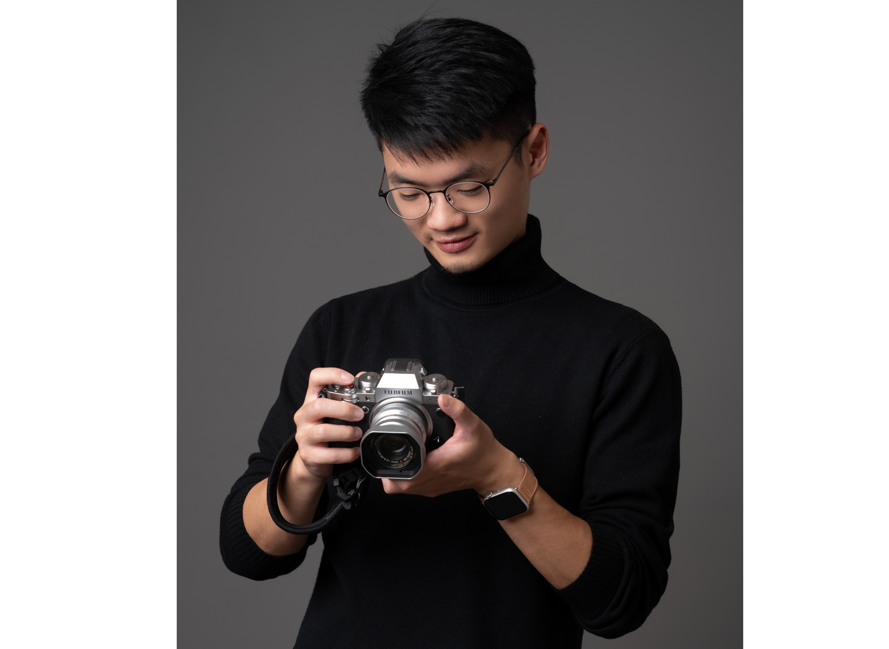

I am a Ph.D. candidate in [FPGA/Parallel Computing Lab](https://fpga.usc.edu) at University of Southern California, advised by [Prof. Prasanna](https://sites.usc.edu/prasanna/).
I'm interested in Machine Learning Systems, Heterogeneous Computing, and Graph Neural Networks.
My recent research focuses on developing Automated Machine Learning Systems, such as auto-tuning runtime system, and FPGA framework that can automatically generate optimized designs.
I was a Research Intern at Microsoft AI Framework team, where I work on distributed inferencing for Multimodal LLMs. 

I completed my undergraduate study in National Taiwan University (NTU), majored in Electrical Engineering. I was also an Electrical Engineering Intern at Hewlett-Packard (HP), Taipei. During my one-year internship, I [patented](https://tinyurl.com/4j42s3bx) my work as first author.

In addition to research interests, I'm also into video editing and photography. Check out my [vlogs](https://youtube.com/playlist?list=PLOgPUn4uH3eyITpOyIsteJNxuKTRnYb6v) and [photos](https://www.flickr.com/photos/194564724@N08/albums).

# Latest News
**May 20, 2024**: Started my internship at Microsoft.

**Apr 6, 2024**: [ARGO](https://arxiv.org/abs/2402.03671) is nominated as the best paper of IPDPS 2024 (4 out of 88 papers). ARGO is now publicly available on the [Deep Grap Library](https://github.com/dmlc/dgl/tree/master/examples/pytorch/argo).

**Dec 19, 2023**: Our work [ARGO](https://arxiv.org/abs/2402.03671) has been accepted to IPDPS 2024 during the first round decesion! Special thanks to Intel Labs for the collaboration.

**Nov 1, 2023**: Passed my qualify exam!

**Jan 10, 2022**: I will be serving as the Registration Chair in [IEEE FCCM](https://www.fccm.org) 2023, see you in LA.
